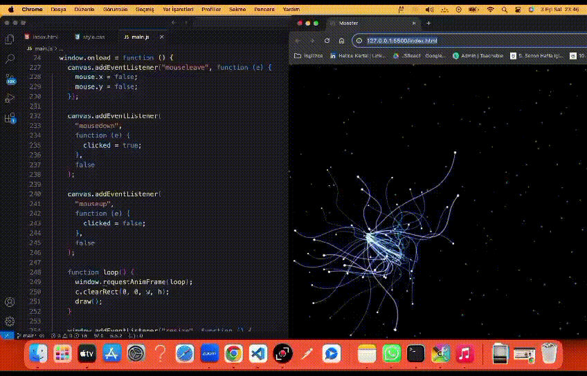

# Monster Project
Electro Monster, interaktif ve dinamik bir görselleştirme projesidir. Proje, elektronların veya partiküllerin hareketlerini görselleştiren etkileyici bir grafik arayüzü sunar. Bu görselleştirme, özellikle fiziksel olayların veya elektronik simülasyonların grafiksel olarak anlaşılmasını kolaylaştırmak amacıyla geliştirilmiştir.

# Özellikler
- Gerçek Zamanlı Görselleştirme: Elektronlar veya partiküller anlık olarak ekranda hareket eder.
- Etkileşimli Arayüz: Kullanıcılar, görselleştirme üzerinde etkileşimde bulunabilir.
- Yüksek Performans: Grafikler yüksek performanslı ve akıcı bir deneyim sunar.
- Kullanıcı Dostu Tasarım: Basit ve anlaşılır arayüzü sayesinde herkesin kullanabileceği bir yapıdadır.

# GIF

